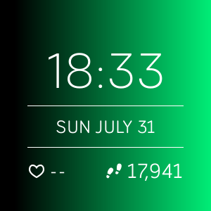
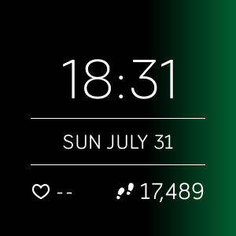
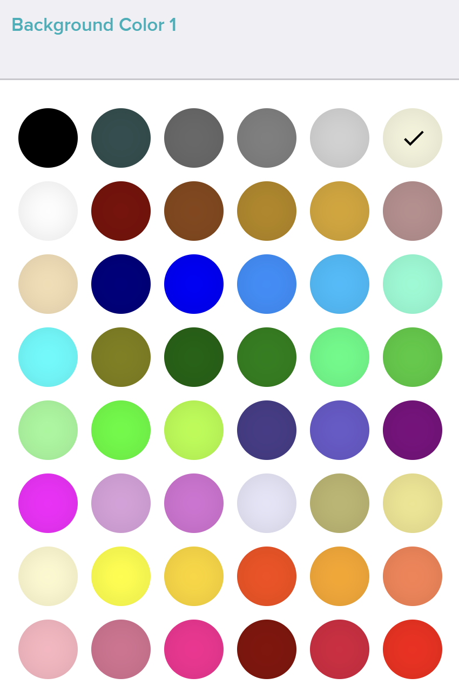
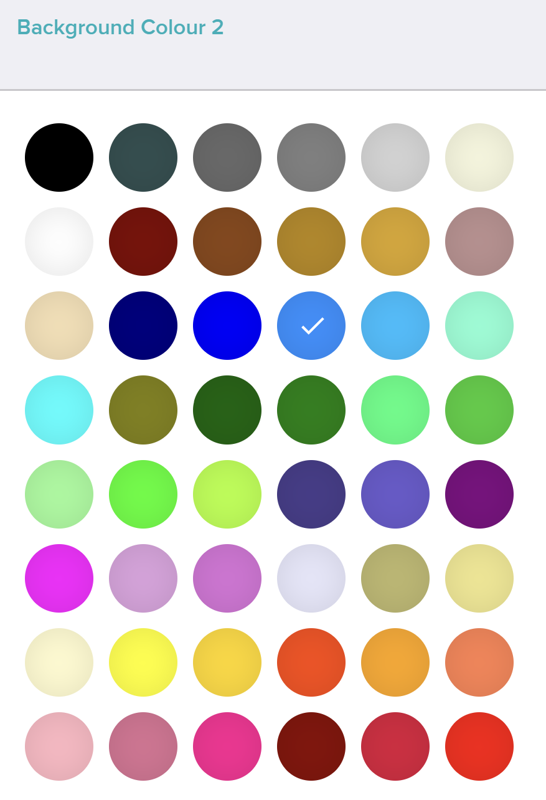
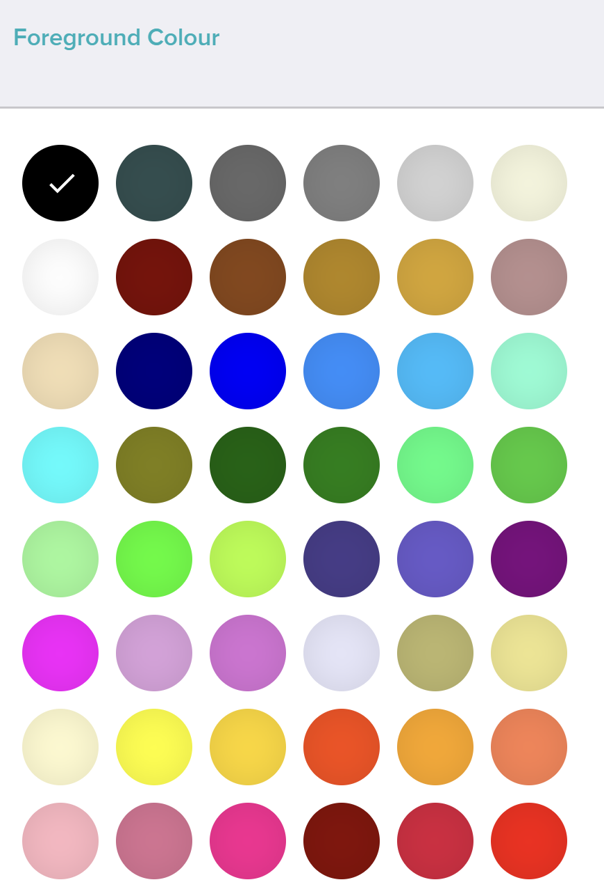
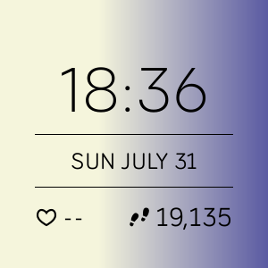

# Gradient seconds clockface

A basic digital clock for Fitbit Versa 2 and Versa Lite but the background gradient can be configured and the seconds update the gradient across the screen.

## The gradient updates with the seconds

## Change the settings

## Update the gradient

